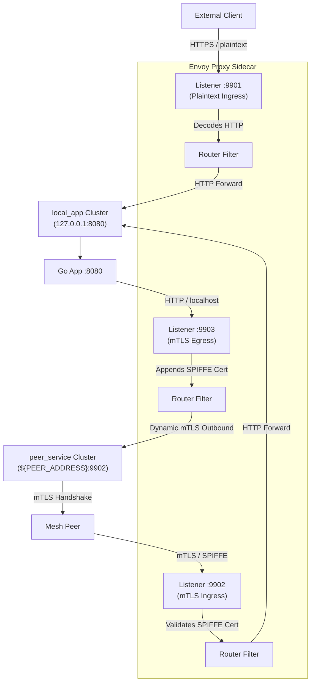

# 🚀 ECS Fargate Sidecar Envoy Architecture

This guide analyzes the Envoy sidecar configuration template used by Fargate workloads, explaining how L4/L7 routing, mTLS, and dynamic secret provisioning (SPIRE SDS) are orchestrated.

---

## 🗺️ Architectural Topology

A single Fargate task runs three ports exposed by the Envoy sidecar container, acting as the secure gateway for the application container running on `localhost:8080`:



---

## 🔑 Breakdown of Fargate Listeners

The configuration defines three specialized listeners to isolate traffic types and security models:

### 1. Plaintext Ingress (Port `9901`)
*   **Purpose**: Handles external VPC traffic, Application Load Balancer (ALB) requests, and health checks.
*   **Security**: Plain TCP/HTTP (the ALB or API Gateway handles TLS termination at the edge).
*   **Routing**: Routes all incoming paths (`prefix: "/"`) directly to the `local_app` cluster (`127.0.0.1:8080`).

### 2. Mesh Ingress (Port `9902`)
*   **Purpose**: Handles trusted service-to-service communication inside the mesh.
*   **Security**: Strict **mTLS** (mutual TLS) using SPIFFE identities.
*   **Secret Provisioning**: Certs are fetched dynamically via **SDS (Secret Discovery Service)** using a local UNIX socket connecting to the SPIRE Agent (`/run/spire/sockets/agent.sock`).
*   **Validation**: It requires client certificates and validates that the caller's SPIFFE ID starts with `spiffe://proteus.local/`.

### 3. Mesh Egress (Port `9903`)
*   **Purpose**: Intercepts outbound calls from the local application container to mesh peers.
*   **Security**: Simple local HTTP. The local application container calls `http://127.0.0.1:9903/` using plain HTTP.
*   **mTLS Injection**: Envoy intercepts this call, automatically injects the local SPIFFE identity cert, performs the mTLS handshake with the remote peer's ingress port (`9902`), and validates the peer's SPIFFE identity.

---

## 🗺️ L7 Virtual Hosts & Route Configurations

To match and steer HTTP requests, Envoy uses **Virtual Hosts** inside the listener's `http_connection_manager`. Here is the concrete YAML structure used in the Fargate template:

### 1. Ingress Virtual Host Matching (Plaintext & mTLS)
Both ingress listeners map incoming connections using this structure:
```yaml
route_config:
  name: local_route
  virtual_hosts:
    - name: local_service
      domains: ["*"]                   # 1. Match any 'Host' header domain
      routes:
        - match: { prefix: "/" }       # 2. Match any URL path
          route: { cluster: local_app } # 3. Send to local Go app cluster (127.0.0.1:8080)
```

### 2. Egress Virtual Host Matching
The egress listener (intercepting your app's outbound calls) uses this structure:
```yaml
route_config:
  name: peer_route
  virtual_hosts:
    - name: peer_service
      domains: ["*"]
      routes:
        - match: { prefix: "/" }
          route: { cluster: peer_service } # Send to peer's address (${PEER_ADDRESS}:9902)
```

---

## 🔄 Critical Flow: Does the Go App Call `localhost:9902`?

**No. The Go App must NEVER call `localhost:9902`.** This is a common point of confusion. 

Here is why:
* **Port `9902` is the secure Mesh Ingress**: It requires an incoming TLS handshake presenting a valid SPIFFE client certificate. Your Go app does not have a client certificate (Envoy manages that). If your Go app attempts to call `localhost:9902`, the connection will be **rejected** immediately by Envoy.
* **Port `9903` is the Mesh Egress**: Your Go app must call **`localhost:9903`** over plain HTTP. 

### The Real End-to-End Inter-Service Flow:

```
 [ Service A Task ]                                       [ Service B Task ]
 ┌──────────────┐                                         ┌──────────────┐
 │  Go App A    │                                         │  Go App B    │
 └──────┬───────┘                                         └──────▲───────┘
        │ 1. http.Get("http://localhost:9903/api/data")          │ 5. plaintext HTTP
        ▼ (plaintext HTTP)                                       │    to port :8080
 ┌──────────────┐                                         ┌──────┴───────┐
 │ Envoy Egress │                                         │ Envoy Ingress│
 │   (:9903)    │                                         │   (:9902)    │
 └──────┬───────┘                                         └──────▲───────┘
        │ 2. Envoy wraps in mTLS                                 │ 4. Envoy validates cert
        │    presents A's SPIFFE cert                            │    and strips mTLS
        └───────────────── 3. SECURE NETWORK mTLS ───────────────┘
                           dials Service B on port :9902
```

1. **Go App A** dials **`http://localhost:9903/api/data`** (Outbox).
2. **Envoy A (:9903)** intercepts, wraps the request in mTLS, and attaches A's SPIFFE client certificate.
3. **Envoy A** opens a network socket to **Service B's IP address on port `9902`** (Inbox).
4. **Envoy B (:9902)** accepts the connection, validates Service A's SPIFFE certificate, strips the mTLS encryption, and forwards a plain HTTP request to **Go App B (:8080)**.

---

## 🛠️ L7 Header Manipulation & Trusted Client Address (XFF)

In a microservice architecture, Envoy plays a vital role as a gatekeeper that sanitizes and enriches L7 HTTP headers before forwarding requests to your app.

### 1. Header Manipulation: The `X-Forwarded-Client-Cert` (XFCC) Flow
To let your backend Go app know who is calling it securely, Envoy performs **header manipulation** by extracting details from the client’s TLS certificate and injecting them into the request as an HTTP header:

```yaml
# Inside the mtls_ingress filter chain config:
forward_client_cert_details: SANITIZE_SET
set_current_client_cert_details:
  uri: true
```

* **`SANITIZE_SET`**: Envoy strips any untrusted `X-Forwarded-Client-Cert` headers sent from outside, then generates a fresh, verified one.
* **`uri: true`**: Tells Envoy to inject the client's **SPIFFE ID** URI into the header.
* **The Go Code Hook**: This is exactly how your Go app in `main.go` safely extracts the caller's identity:
  ```go
  xfcc := r.Header.Get("X-Forwarded-Client-Cert")
  // Extracts "spiffe://proteus.local/service-b" from:
  // "By=spiffe://proteus.local/service-a;Hash=...;URI=spiffe://proteus.local/service-b"
  callerID := parseXFCC(xfcc)
  ```

---

### 🛡️ Preventing IP Spoofing: Trusting Client IPs with `X-Forwarded-For` (XFF)

When traffic goes through multiple load balancers (e.g., **Client ➔ Internet ➔ ALB ➔ Envoy ➔ Go App**), your Go App's `r.RemoteAddr` will always show Envoy's local IP (`127.0.0.1`), losing the real client IP.

To solve this, Envoy appends the client IP to the `X-Forwarded-For` (XFF) header. However, **hackers can spoof this header** by sending fake `X-Forwarded-For` values from the internet. Envoy uses two critical configuration parameters in `http_connection_manager` to prevent this:

```yaml
# In your ingress http_connection_manager settings:
use_remote_address: true
xff_num_trusted_hops: 1
```

#### How it works:
1. **`use_remote_address: true`** *(Recommended)*:
   Instructs Envoy to use the **actual downstream physical IP connection** as the trusted source. It treats that physical connection as a hop and appends it to the incoming `X-Forwarded-For` list.
2. **`xff_num_trusted_hops: 1`**:
   Tells Envoy exactly how many trusted proxy hops exist in front of it (e.g., your AWS ALB counts as `1` trusted hop). 
   * Envoy will traverse the `X-Forwarded-For` list from the right side, skip `1` entry (the trusted ALB's IP), and identify the next address to the left as the **authenticated, un-spoofable client IP**.
   * Any IP addresses further to the left (which could have been sent by an external attacker to spoof their location) are treated as untrusted.

### 🌐 The L7 `:authority` Pseudo-Header

In modern web protocols (HTTP/2 and HTTP/3), the classic HTTP/1.1 `Host` header is replaced by the **`:authority` pseudo-header** to specify the target domain of a request.
* **Envoy's Unified Engine**: Internally, Envoy is HTTP/2 first. It normalizes all incoming HTTP/1.1 `Host` headers into the `:authority` pseudo-header. When Envoy evaluates its `virtual_hosts` routing rules, it compares the `:authority` header against the `domains` list.

#### 🏢 Production Load Balancer (ALB) Example:

Consider an AWS Application Load Balancer (ALB) acting as the public ingress for your service mesh:

```
[ Client Browser ] 
       │
       │ HTTP/2 Connection
       │ :authority: "api.proteus.local"
       ▼
[ AWS Application Load Balancer (ALB) ]
       │
       │ HTTP/1.1 Connection (Normalizes back to Host header)
       │ Host: "api.proteus.local"
       ▼
[ Envoy Ingress (:9901) ]
       │
       │ Envoy translates Host ➔ :authority: "api.proteus.local"
       │ Evaluates Virtual Host match rules:
       │   domains: ["api.proteus.local"] or ["*"] ➔ MATCH ✅
       ▼
[ Go Application (:8080) ]
```

1. **Client** initiates a request using HTTP/2. The browser automatically formats the request target using the `:authority: api.proteus.local` pseudo-header.
2. **AWS ALB** terminates the external client connection. In many enterprise settings, the connection *between* the ALB and your Fargate containers goes over HTTP/1.1. Therefore, the ALB translates `:authority` back into the classic L7 `Host: api.proteus.local` header.
3. **Envoy (:9901)** receives the HTTP/1.1 request, parses the `Host` header, and internally normalizes it into `:authority: api.proteus.local` for its routing engine.
4. **Virtual Host Match**: Envoy inspects the `:authority` header, matches it against your configured `virtual_hosts` domains list, and successfully forwards the request to your local application cluster.

---

## 🔌 Dynamic SDS Integration with SPIRE

Rather than loading certificates from static local files (which requires task restarts upon renewal), Envoy uses the **Secret Discovery Service (SDS)** to streams certs dynamically from the **SPIRE Agent** over a shared UDS volume socket.

### SDS Configuration Block
```yaml
transport_socket:
  name: envoy.transport_sockets.tls
  typed_config:
    "@type": type.googleapis.com/envoy.extensions.transport_sockets.tls.v3.DownstreamTlsContext
    require_client_certificate: true
    common_tls_context:
      tls_certificate_sds_secret_configs:
        - name: "${SPIFFE_ID}"
          sds_config:
            resource_api_version: V3
            api_config_source:
              api_type: GRPC
              transport_api_version: V3
              grpc_services:
                envoy_grpc:
                  cluster_name: spire_agent
```

### The SPIRE Agent Cluster definition:
```yaml
- name: spire_agent
  connect_timeout: 0.25s
  http2_protocol_options: {}
  type: STATIC
  load_assignment:
    cluster_name: spire_agent
    endpoints:
      - lb_endpoints:
          - endpoint:
              address:
                pipe:
                  path: /run/spire/sockets/agent.sock
```

---

## 🔄 How the Variables are Resolved
Fargate injects environment variables at container startup:
*   `${SERVICE_NAME}`: Resolves the unique name of the Fargate service for logging and identity context.
*   `${SPIFFE_ID}`: The identity token assigned by SPIRE (e.g., `spiffe://proteus.local/service-a`).
*   `${PEER_ADDRESS}`: The DNS or IP address of the peer Fargate service.
