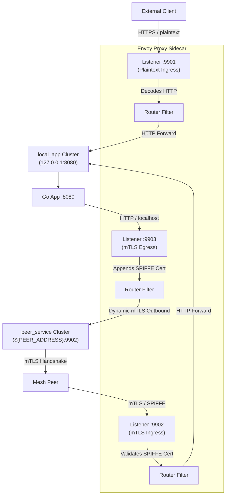

# 🚀 ECS Fargate Sidecar Envoy Architecture

This guide analyzes the Envoy sidecar configuration template used by Fargate workloads, explaining how L4/L7 routing, mTLS, and dynamic secret provisioning (SPIRE SDS) are orchestrated.

---

## 🗺️ Architectural Topology

A single Fargate task runs three ports exposed by the Envoy sidecar container, acting as the secure gateway for the application container running on `localhost:8080`:



---

## 🔑 Breakdown of Fargate Listeners

The configuration defines three specialized listeners to isolate traffic types and security models:

### 1. Plaintext Ingress (Port `9901`)
*   **Purpose**: Handles external VPC traffic, Application Load Balancer (ALB) requests, and health checks.
*   **Security**: Plain TCP/HTTP (the ALB or API Gateway handles TLS termination at the edge).
*   **Routing**: Routes all incoming paths (`prefix: "/"`) directly to the `local_app` cluster (`127.0.0.1:8080`).

### 2. Mesh Ingress (Port `9902`)
*   **Purpose**: Handles trusted service-to-service communication inside the mesh.
*   **Security**: Strict **mTLS** (mutual TLS) using SPIFFE identities.
*   **Secret Provisioning**: Certs are fetched dynamically via **SDS (Secret Discovery Service)** using a local UNIX socket connecting to the SPIRE Agent (`/run/spire/sockets/agent.sock`).
*   **Validation**: It requires client certificates and validates that the caller's SPIFFE ID starts with `spiffe://proteus.local/`.

### 3. Mesh Egress (Port `9903`)
*   **Purpose**: Intercepts outbound calls from the local application container to mesh peers.
*   **Security**: Simple local HTTP. The local application container calls `http://127.0.0.1:9903/` using plain HTTP.
*   **mTLS Injection**: Envoy intercepts this call, automatically injects the local SPIFFE identity cert, performs the mTLS handshake with the remote peer's ingress port (`9902`), and validates the peer's SPIFFE identity.

---

## 🔌 Dynamic SDS Integration with SPIRE

Rather than loading certificates from static local files (which requires task restarts upon renewal), Envoy uses the **Secret Discovery Service (SDS)** to streams certs dynamically from the **SPIRE Agent** over a shared UDS volume socket.

### SDS Configuration Block
```yaml
transport_socket:
  name: envoy.transport_sockets.tls
  typed_config:
    "@type": type.googleapis.com/envoy.extensions.transport_sockets.tls.v3.DownstreamTlsContext
    require_client_certificate: true
    common_tls_context:
      tls_certificate_sds_secret_configs:
        - name: "${SPIFFE_ID}"
          sds_config:
            resource_api_version: V3
            api_config_source:
              api_type: GRPC
              transport_api_version: V3
              grpc_services:
                envoy_grpc:
                  cluster_name: spire_agent
```

### The SPIRE Agent Cluster definition:
```yaml
- name: spire_agent
  connect_timeout: 0.25s
  http2_protocol_options: {}
  type: STATIC
  load_assignment:
    cluster_name: spire_agent
    endpoints:
      - lb_endpoints:
          - endpoint:
              address:
                pipe:
                  path: /run/spire/sockets/agent.sock
```

---

## 🔄 How the Variables are Resolved
Fargate injects environment variables at container startup:
*   `${SERVICE_NAME}`: Resolves the unique name of the Fargate service for logging and identity context.
*   `${SPIFFE_ID}`: The identity token assigned by SPIRE (e.g., `spiffe://proteus.local/service-a`).
*   `${PEER_ADDRESS}`: The DNS or IP address of the peer Fargate service.
