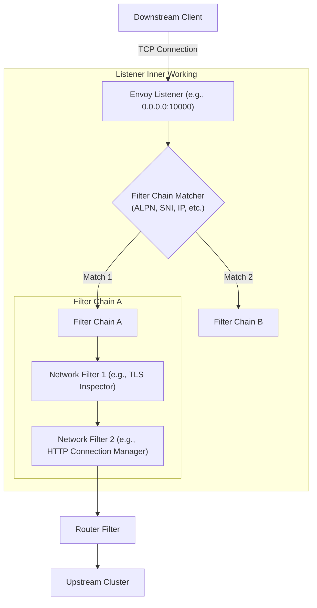

# 🎧 Envoy Listeners: Architecture & Concepts

In Envoy, a **Listener** is the entry point for all incoming network traffic. It is a named network location (e.g., an IP address and port, or a Unix Domain Socket) that Envoy binds to, waiting for downstream clients to initiate connections.

At its core, a Listener is responsible for:
1. **Binding to a socket** to accept incoming TCP/UDP connections.
2. **Executing a Filter Chain** to process and route the raw network data.

---

## 🧩 Visualizing the Listener Architecture

Here is how a Listener sits at the edge of the Envoy proxy, acting as the gateway that processes downstream traffic:

---

## 🔑 Key Concepts inside a Listener

1. **Network Address & Port**: 
   Specifies where the listener listens (e.g., `0.0.0.0:443` or `127.0.0.1:15001`).
   
2. **Filter Chains**:
   Each listener contains one or more filter chains. When a connection is accepted, Envoy determines which filter chain to execute using **Filter Chain Match** criteria.
   
3. **Filter Chain Matchers**:
   Rules used to select a specific filter chain based on metadata from the connection, such as:
   * **SNI (Server Name Indication)**: Useful for routing TLS traffic to different domains on the same port.
   * **ALPN (Application-Layer Protocol Negotiation)**: E.g., deciding whether the protocol is HTTP/1.1, HTTP/2, or raw TCP.
   * **Source/Destination IPs & Ports**.

4. **Network/L4 Filters**:
   These filters run sequentially to inspect or modify connection data. Examples:
   * `envoy.filters.network.http_connection_manager` (translates L4 raw bytes into L7 HTTP requests).
   * `envoy.filters.network.tcp_proxy` (basic L4 tunneling/forwarding).
   * `envoy.filters.network.thrift_proxy` (handles Apache Thrift protocol).

---

## 🕸️ The Istio Connection

In an Istio Service Mesh, `istiod` dynamically configures hundreds of listeners on your Envoy sidecars (`istio-proxy`).

* **Inbound Listener (Port `15006`)**: 
  All incoming traffic to a pod is intercepted by `iptables` and redirected to port `15006`. This single physical listener matches virtual filter chains based on the target port of the original traffic to apply policies like mTLS, authorization, and L7 routing.
* **Outbound Listener (Port `15001`)**: 
  All egress traffic from your application container is intercepted and redirected to port `15001`. Envoy processes this and routes it to the appropriate external or internal cluster.
* **Virtual Listeners**: 
  Istio configures virtual listeners corresponding to the Kubernetes `Service` IPs and ports in your cluster so Envoy knows how to intercept and handle requests meant for those services.
