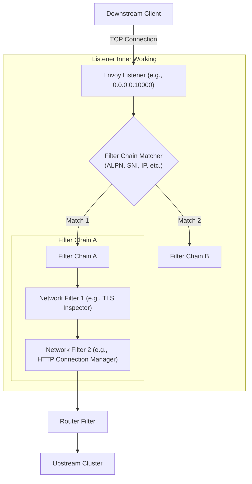
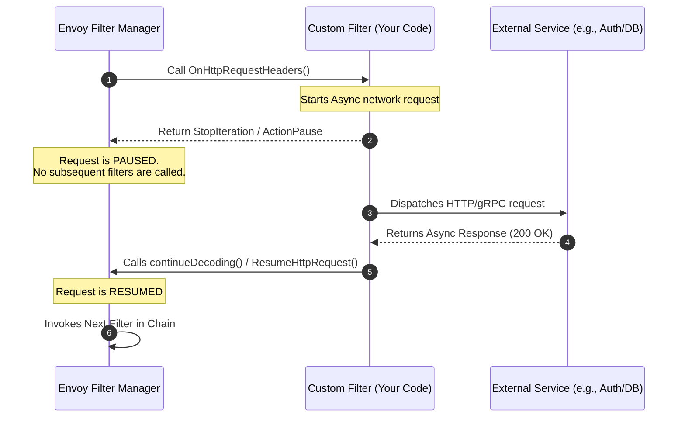
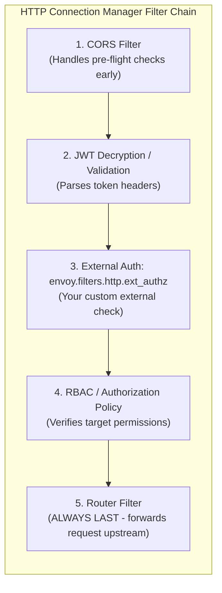

# 🎧 Envoy Listeners: Architecture & Concepts

In Envoy, a **Listener** is the entry point for all incoming network traffic. It is a named network location (e.g., an IP address and port, or a Unix Domain Socket) that Envoy binds to, waiting for downstream clients to initiate connections.

At its core, a Listener is responsible for:
1. **Binding to a socket** to accept incoming TCP/UDP connections.
2. **Executing a Filter Chain** to process and route the raw network data.

---

## 🧩 Visualizing the Listener Architecture

Here is how a Listener sits at the edge of the Envoy proxy, acting as the gateway that processes downstream traffic:



---

## 🔑 Key Concepts inside a Listener

1. **Network Address & Port**: 
   Specifies where the listener listens (e.g., `0.0.0.0:443` or `127.0.0.1:15001`).
   
2. **Filter Chains**:
   Each listener contains one or more filter chains. When a connection is accepted, Envoy determines which filter chain to execute using **Filter Chain Match** criteria.
   
3. **Filter Chain Matchers**:
   Rules used to select a specific filter chain based on metadata from the connection, such as:
   * **SNI (Server Name Indication)**: Useful for routing TLS traffic to different domains on the same port.
   * **ALPN (Application-Layer Protocol Negotiation)**: E.g., deciding whether the protocol is HTTP/1.1, HTTP/2, or raw TCP.
   * **Source/Destination IPs & Ports**.

4. **Network/L4 Filters**:
   These filters run sequentially to inspect or modify connection data. Examples:
   * `envoy.filters.network.http_connection_manager` (translates L4 raw bytes into L7 HTTP requests).
   * `envoy.filters.network.tcp_proxy` (basic L4 tunneling/forwarding).
   * `envoy.filters.network.thrift_proxy` (handles Apache Thrift protocol).

## 🔄 Filter Chain Iteration & Control Flow

When a connection or request flows through Envoy's filter chain, Envoy's Filter Manager executes each filter sequentially. But how does a filter indicate whether it is done and ready to **pass control to the next filter**?

This is managed by returning **Filter Statuses** (or continuation actions) from the filter callbacks:

### 1. Network (L4) Filters
For L4 filters processing connections and raw read/write buffers, callbacks return a `Network::FilterStatus`:
*   **`Continue`**: Passes the connection/data to the next filter in the chain immediately.
*   **`StopIteration`**: Pauses filter chain execution. Subsequent filters will not be called until the current filter explicitly resumes execution (by calling callback functions to continue). This is useful if a filter is waiting on asynchronous data (e.g., checking an external auth service).

### 2. HTTP (L7) Filters
For HTTP filters handling headers, data, or trailers, callbacks return L7-specific statuses like `Http::FilterHeadersStatus` or `Http::FilterDataStatus`:
*   **`Continue`**: Instructs the HTTP Connection Manager to pass the headers, body, or trailers to the next HTTP filter in the chain.
*   **`StopIteration`**: Pauses HTTP filter chain iteration. The current filter holds the request/response until it asynchronously resumes it.
*   **`StopAllIterationAndBuffer` / `StopAllIterationAndWatermark`**: Pauses iteration and buffers the incoming request data, waiting for the filter to complete its logic before moving on.

### 🛠️ How to Implement This in a Custom Filter

When you create a custom Envoy filter—either natively in **C++** or using **WebAssembly (Proxy-Wasm)**—you implement callback interfaces. Here is how your code controls this flow:

#### Option A: Native C++ Http Filter
In native Envoy development, you implement the `Http::StreamDecoderFilter` interface.

```cpp
// 1. In header processing, if you need an async external check (e.g. Auth):
Http::FilterHeadersStatus MyAuthFilter::decodeHeaders(Http::RequestHeaderMap& headers, bool end_stream) {
    if (isAuthorized(headers)) {
        // Everything is fine, pass the request to the next filter immediately
        return Http::FilterHeadersStatus::Continue;
    }
    
    // Start an asynchronous auth request
    initiateAsyncAuthLookup([this](bool success) {
        if (success) {
            // 2. When async callback completes, resume the chain!
            decoder_callbacks_->continueDecoding();
        } else {
            // Or reject the request
            decoder_callbacks_->sendLocalReply(Http::Code::Unauthorized, "Unauthorized", nullptr, absl::nullopt, "");
        }
    });

    // Tell Envoy to PAUSE and wait
    return Http::FilterHeadersStatus::StopIteration;
}
```

#### Option B: WebAssembly / Proxy-Wasm (Go SDK)
In modern Istio meshes, custom filters are usually written in Go, Rust, or C++ and compiled to Wasm. In the Go Proxy-Wasm SDK:

```go
type MyFilter struct {
    types.DefaultHttpContext
}

// 1. When headers are received:
func (f *MyFilter) OnHttpRequestHeaders(numHeaders int, endOfStream bool) types.Action {
    if isValidRequest() {
        // Pass control to the next filter in the Wasm chain
        return types.ActionContinue
    }
    
    // Trigger asynchronous network call
    f.dispatchAsyncCall(func(responseBody []byte) {
        if checkResponse(responseBody) {
            // 2. Resume request processing when the response returns!
            proxywasm.ResumeHttpRequest()
        } else {
            proxywasm.SendHttpResponse(403, nil, []byte("Forbidden"), -1)
        }
    })

    // PAUSE the execution chain
    return types.ActionPause
}
```

#### 🔄 Async Pause & Resume Flow



#### 🔌 Custom Wasm Filters vs. Built-in Ext-Authz

You do not **always** need to write a custom Wasm or C++ filter to implement custom authentication! Envoy has a rich landscape of built-in filters. 

##### 1. The Built-in `ext_authz` Filter
Instead of writing a low-level filter in Wasm or C++, you can use Envoy’s built-in **External Authorization Filter** (`envoy.filters.http.ext_authz`).
* **How it works**: The built-in `ext_authz` filter is already compiled into Envoy. You configure it via YAML/JSON to point to an external service (which you write in Go, Node.js, Python, etc.) over gRPC or HTTP. 
* **The Flow**: When a request hits `ext_authz`, it pauses the iteration, asks your external service if the request is allowed, and then either resumes or returns a `401/403` based on your service's reply.

##### 2. Where does `ext_authz` fit in the Filter Tree?
The `ext_authz` filter is an **HTTP L7 filter** located inside the `HTTP Connection Manager` filter list. In a production filter chain, order is critical:



* **Why this order?**
  * You place it **after** JWT validation because you don't want to make an expensive network call to your external auth service if the JWT is invalid or expired.
  * You place it **before** the **Router filter** because the Router is always the terminal filter that completes the chain by forwarding the request upstream.

## 🔄 L7 Upstream Response & Local Reply Transformation

Envoy allows you to dynamically intercept, modify, or rewrite responses sent by upstream servers (or generated locally by Envoy itself) based on HTTP status codes. There are three common ways to achieve this:

### 1. Header Manipulation based on Response Codes
You can append, rewrite, or inject HTTP headers based on upstream responses at the Route or Virtual Host level:
```yaml
route_config:
  virtual_hosts:
    - name: backend_service
      domains: ["*"]
      routes:
        - match: { prefix: "/" }
          route:
            cluster: local_app
            # Dynamic header injection using Envoy formatting specifiers:
            response_headers_to_add:
              - header:
                  key: "x-upstream-status"
                  value: "%RESPONSE_CODE%"
              - header:
                  key: "x-response-flags"
                  value: "%RESPONSE_FLAGS%"
```

### 2. Local Reply Modification (`local_reply_config`)
When Envoy itself rejects a request (e.g., a `503 Service Unavailable` due to cluster connection failure, or a `403 Forbidden` from RBAC), you can use `local_reply_config` inside the `http_connection_manager` to catch the error code and map it to a custom response payload or custom headers:
```yaml
local_reply_config:
  mappers:
    - filter:
        status_code_filter:
          comparison:
            op: EQ
            value: 503
      headers_to_add:
        - header:
            key: "x-custom-fallback"
            value: "active"
      body_format_override:
        text_format: "Our backend cluster is experiencing high load. Please try again shortly."
```

### 3. Lightweight Response Rewriting using the Lua Filter
If you need dynamic script-based response modification (for example, converting an upstream `500 Internal Server Error` into a clean, client-facing `503 Service Unavailable` with customized headers), you can configure the built-in HTTP **Lua Filter**:
```yaml
http_filters:
  - name: envoy.filters.http.lua
    typed_config:
      "@type": type.googleapis.com/envoy.extensions.filters.http.lua.v3.Lua
      default_source_code:
        inline_string: |
          function envoy_on_response(response_handle)
            -- 1. Read upstream status code
            local status = response_handle:headers():get(":status")
            
            -- 2. If status is a 500 server error, modify the response
            if status == "500" then
              response_handle:headers():replace(":status", "503")
              response_handle:headers():add("x-rewritten-by", "envoy-lua")
              response_handle:body():setBytes("The backend returned an error. Converted to a clean 503 response.")
            end
          end
  - name: envoy.filters.http.router
    typed_config:
      "@type": type.googleapis.com/envoy.extensions.filters.http.router.v3.Router
```

---

## 🕸️ The Istio Connection

In an Istio Service Mesh, `istiod` dynamically configures hundreds of listeners on your Envoy sidecars (`istio-proxy`).

* **Inbound Listener (Port `15006`)**: 
  All incoming traffic to a pod is intercepted by `iptables` and redirected to port `15006`. This single physical listener matches virtual filter chains based on the target port of the original traffic to apply policies like mTLS, authorization, and L7 routing.
* **Outbound Listener (Port `15001`)**: 
  All egress traffic from your application container is intercepted and redirected to port `15001`. Envoy processes this and routes it to the appropriate external or internal cluster.
* **Virtual Listeners**: 
  Istio configures virtual listeners corresponding to the Kubernetes `Service` IPs and ports in your cluster so Envoy knows how to intercept and handle requests meant for those services.
