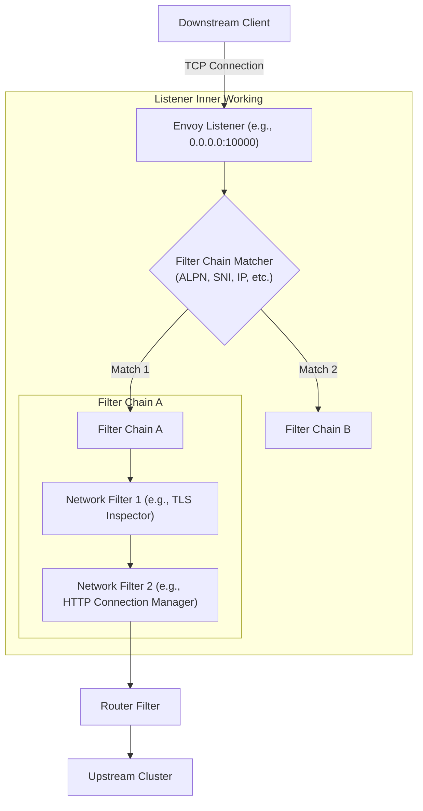
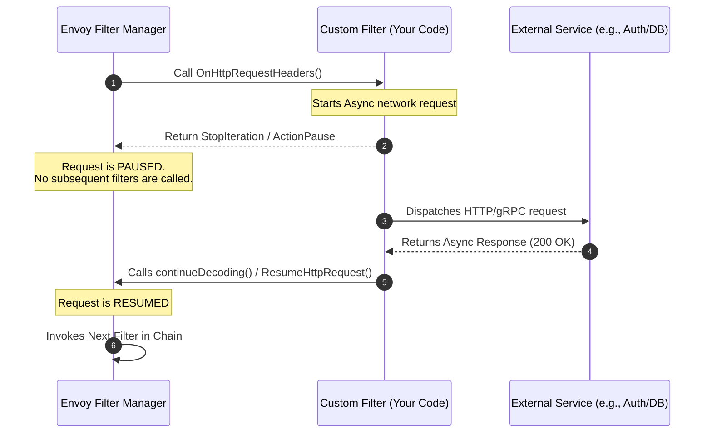
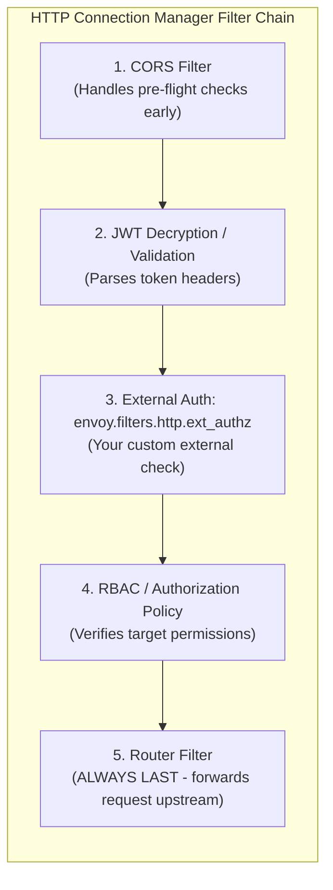

# 🎧 Envoy Listeners: Architecture & Concepts

In Envoy, a **Listener** is the entry point for all incoming network traffic. It is a named network location (e.g., an IP address and port, or a Unix Domain Socket) that Envoy binds to, waiting for downstream clients to initiate connections.

At its core, a Listener is responsible for:
1. **Binding to a socket** to accept incoming TCP/UDP connections.
2. **Executing a Filter Chain** to process and route the raw network data.

---

## 🧩 Visualizing the Listener Architecture

Here is how a Listener sits at the edge of the Envoy proxy, acting as the gateway that processes downstream traffic:



---

## 🗺️ Master Configuration Hierarchy: Visualizing `route_config` vs `http_filters`

When writing Envoy configuration files by hand, the nested structure can feel extremely complex. The key to mastering this schema without fear is understanding the **sibling relationship** inside the **`HttpConnectionManager` (HCM)**.

### 🌳 The Master Config Hierarchy Tree

Here is the exact nesting structure of a listener. Note how the **`route_config`** (routing directory) and **`http_filters`** (L7 processing chain) sit side-by-side as siblings under the HCM's `typed_config`:

```text
Listener (Ex: Port 80)
└── filter_chains
    └── filters (L4 Network Filters)
        └── envoy.filters.network.http_connection_manager (HCM)
            └── typed_config
                │
                ├── route_config  ◄─── [ SIBLING 1: The Routing Directory / Map ]
                │   └── virtual_hosts
                │       └── domains (Matches ":authority" / "Host" header)
                │       └── routes (Matches path prefix "/api")
                │           └── route
                │               ├── cluster (Target backend upstream)
                │               ├── retry_policy
                │               └── response_headers_to_add
                │
                └── http_filters  ◄─── [ SIBLING 2: The L7 Processing Pipeline ]
                    ├── envoy.filters.http.cors
                    ├── envoy.filters.http.jwt_authn
                    ├── envoy.filters.http.lua
                    └── envoy.filters.http.router  ◄── (The terminal filter)
```

### 🧠 Why are they siblings? (Separation of Concerns)

Envoy separates the **Routing Directory** from the **Processing Pipeline** for cleaner configuration:
*   **`http_filters` (The Pipeline)**: Decides *how* requests and responses are inspected or transformed (e.g. CORS logic, JWT validation, inline Lua script execution).
*   **`route_config` (The Map)**: Decides *where* the requests are directed (host matching, prefix paths, retries, weighted splits).

### 🔗 The Router Bridge

How does a request moving through `http_filters` find its target in `route_config`?
The connection is established by the very last filter in the HTTP chain: **`envoy.filters.http.router`**. 

The **Router Filter** acts as the dynamic bridge. Once the request successfully passes all preceding filters (CORS, JWT, etc.), the Router looks sideways at the sibling `route_config` map, matches the host/path, and routes the request upstream!

> [!WARNING]
> Because it terminates the filter pipeline to forward the request, the **Router Filter** must **ALWAYS** be the very last element in the `http_filters` list. Placing filters after the router will cause Envoy to throw errors and fail to start.

---

### 🛠️ Stacking Filters: How to Add More Filters (Without Repeating the HCM!)

If you want to add multiple HTTP filters (like checking a **JWT Token**, running a **CORS check**, and executing a **Lua Script** on the same route), **you do NOT repeat the `http_connection_manager`!**

You keep a **single, unified HTTP Connection Manager** (L4 Network filter), and simply stack the new L7 filters sequentially inside its **`http_filters`** list:

```yaml
# ====================================================================
# FULLY COMPLETE ENVOY.YAML CONFIGURATION LAYOUT
# Demonstrating L4 Listener -> Single L4 HCM Filter -> L7 Stack -> Upstream Cluster
# ====================================================================

static_resources:
  listeners:
    - name: my_listener
      address:
        socket_address:
          address: 0.0.0.0
          port_value: 80 # Listen on L4 Port 80

      filter_chains:
        - filters:
            # ────────────────────────────────────────────────────────
            # EXACTLY ONE L4 Network Filter in the L4 chain list!
            # ────────────────────────────────────────────────────────
            - name: envoy.filters.network.http_connection_manager
              typed_config:
                "@type": type.googleapis.com/envoy.extensions.filters.network.http_connection_manager.v3.HttpConnectionManager
                stat_prefix: ingress_http
                
                # --- SIBLING 1: L7 Routing Map ---
                route_config:
                  name: local_route
                  virtual_hosts:
                    - name: backend_service
                      domains: ["*"]
                      routes:
                        - match: { prefix: "/" }
                          route:
                            cluster: local_app  # ◄── Maps to Cluster defined below!

                # --- SIBLING 2: L7 Sequential Processing Stack ---
                http_filters:
                  # --- HTTP FILTER 1: CORS Policy check ---
                  - name: envoy.filters.http.cors
                    typed_config:
                      "@type": type.googleapis.com/envoy.extensions.filters.http.cors.v3.Cors

                  # --- HTTP FILTER 2: Validate OAuth2 / JWT Tokens ---
                  - name: envoy.filters.http.jwt_authn
                    typed_config:
                      "@type": type.googleapis.com/envoy.extensions.filters.http.jwt_authn.v3.JwtAuthentication

                  # --- HTTP FILTER 3: Execute Custom Lua Scripts ---
                  - name: envoy.filters.http.lua
                    typed_config:
                      "@type": type.googleapis.com/envoy.extensions.filters.http.lua.v3.Lua
                      default_source_code:
                        inline_string: |
                          function envoy_on_response(response_handle)
                            response_handle:headers():add("x-custom-jwt-verified", "true")
                          end

                  # --- TERMINAL HTTP FILTER: Route the request sideways ---
                  - name: envoy.filters.http.router
                    typed_config:
                      "@type": type.googleapis.com/envoy.extensions.filters.http.router.v3.Router

  # ────────────────────────────────────────────────────────
  # UPSTREAM CLUSTERS DEFINITION (At root level of static_resources)
  # ────────────────────────────────────────────────────────
  clusters:
    - name: local_app
      connect_timeout: 0.25s
      type: STATIC
      lb_policy: ROUND_ROBIN
      load_assignment:
        cluster_name: local_app
        endpoints:
          - lb_endpoints:
              - endpoint:
                  address:
                    socket_address:
                      address: 127.0.0.1
                      port_value: 8080 # The local Go App destination (Upstream)
```

---

### ⚠️ What happens if you omit the `router` filter?

If you do not include the **`envoy.filters.http.router`** filter at the end of the `http_filters` list:

1. **Configuration Failure**: Envoy will fail to pass schema validation and will **refuse to start** (throwing a startup error stating that a terminal filter is missing).
2. **No Destination**: Without the Router, Envoy has no mechanism to map the request to the `route_config` and clusters. The request is processed by the filters but never routed upstream!

---

## 🔑 Key Concepts inside a Listener

1. **Network Address & Port**: 
   Specifies where the listener listens (e.g., `0.0.0.0:443` or `127.0.0.1:15001`).
   
2. **Filter Chains**:
   Each listener contains one or more filter chains. When a connection is accepted, Envoy determines which filter chain to execute using **Filter Chain Match** criteria.
   
3. **Filter Chain Matchers**:
   Rules used to select a specific filter chain based on metadata from the connection, such as:
   * **SNI (Server Name Indication)**: Useful for routing TLS traffic to different domains on the same port.
   * **ALPN (Application-Layer Protocol Negotiation)**: E.g., deciding whether the protocol is HTTP/1.1, HTTP/2, or raw TCP.
   * **Source/Destination IPs & Ports**.

4. **Network/L4 Filters**:
   These filters run sequentially to inspect or modify connection data. Examples:
   * `envoy.filters.network.http_connection_manager` (translates L4 raw bytes into L7 HTTP requests).
   * `envoy.filters.network.tcp_proxy` (basic L4 tunneling/forwarding).
   * `envoy.filters.network.thrift_proxy` (handles Apache Thrift protocol).

## 🔄 Filter Chain Iteration & Control Flow

When a connection or request flows through Envoy's filter chain, Envoy's Filter Manager executes each filter sequentially. But how does a filter indicate whether it is done and ready to **pass control to the next filter**?

This is managed by returning **Filter Statuses** (or continuation actions) from the filter callbacks:

### 1. Network (L4) Filters
For L4 filters processing connections and raw read/write buffers, callbacks return a `Network::FilterStatus`:
*   **`Continue`**: Passes the connection/data to the next filter in the chain immediately.
*   **`StopIteration`**: Pauses filter chain execution. Subsequent filters will not be called until the current filter explicitly resumes execution (by calling callback functions to continue). This is useful if a filter is waiting on asynchronous data (e.g., checking an external auth service).

### 2. HTTP (L7) Filters
For HTTP filters handling headers, data, or trailers, callbacks return L7-specific statuses like `Http::FilterHeadersStatus` or `Http::FilterDataStatus`:
*   **`Continue`**: Instructs the HTTP Connection Manager to pass the headers, body, or trailers to the next HTTP filter in the chain.
*   **`StopIteration`**: Pauses HTTP filter chain iteration. The current filter holds the request/response until it asynchronously resumes it.
*   **`StopAllIterationAndBuffer` / `StopAllIterationAndWatermark`**: Pauses iteration and buffers the incoming request data, waiting for the filter to complete its logic before moving on.

### 🛠️ How to Implement This in a Custom Filter

When you create a custom Envoy filter—either natively in **C++** or using **WebAssembly (Proxy-Wasm)**—you implement callback interfaces. Here is how your code controls this flow:

#### Option A: Native C++ Http Filter
In native Envoy development, you implement the `Http::StreamDecoderFilter` interface.

```cpp
// 1. In header processing, if you need an async external check (e.g. Auth):
Http::FilterHeadersStatus MyAuthFilter::decodeHeaders(Http::RequestHeaderMap& headers, bool end_stream) {
    if (isAuthorized(headers)) {
        // Everything is fine, pass the request to the next filter immediately
        return Http::FilterHeadersStatus::Continue;
    }
    
    // Start an asynchronous auth request
    initiateAsyncAuthLookup([this](bool success) {
        if (success) {
            // 2. When async callback completes, resume the chain!
            decoder_callbacks_->continueDecoding();
        } else {
            // Or reject the request
            decoder_callbacks_->sendLocalReply(Http::Code::Unauthorized, "Unauthorized", nullptr, absl::nullopt, "");
        }
    });

    // Tell Envoy to PAUSE and wait
    return Http::FilterHeadersStatus::StopIteration;
}
```

#### Option B: WebAssembly / Proxy-Wasm (Go SDK)
In modern Istio meshes, custom filters are usually written in Go, Rust, or C++ and compiled to Wasm. In the Go Proxy-Wasm SDK:

```go
type MyFilter struct {
    types.DefaultHttpContext
}

// 1. When headers are received:
func (f *MyFilter) OnHttpRequestHeaders(numHeaders int, endOfStream bool) types.Action {
    if isValidRequest() {
        // Pass control to the next filter in the Wasm chain
        return types.ActionContinue
    }
    
    // Trigger asynchronous network call
    f.dispatchAsyncCall(func(responseBody []byte) {
        if checkResponse(responseBody) {
            // 2. Resume request processing when the response returns!
            proxywasm.ResumeHttpRequest()
        } else {
            proxywasm.SendHttpResponse(403, nil, []byte("Forbidden"), -1)
        }
    })

    // PAUSE the execution chain
    return types.ActionPause
}
```

#### 🔄 Async Pause & Resume Flow



#### 🔌 Custom Wasm Filters vs. Built-in Ext-Authz

You do not **always** need to write a custom Wasm or C++ filter to implement custom authentication! Envoy has a rich landscape of built-in filters. 

##### 1. The Built-in `ext_authz` Filter
Instead of writing a low-level filter in Wasm or C++, you can use Envoy’s built-in **External Authorization Filter** (`envoy.filters.http.ext_authz`).
* **How it works**: The built-in `ext_authz` filter is already compiled into Envoy. You configure it via YAML/JSON to point to an external service (which you write in Go, Node.js, Python, etc.) over gRPC or HTTP. 
* **The Flow**: When a request hits `ext_authz`, it pauses the iteration, asks your external service if the request is allowed, and then either resumes or returns a `401/403` based on your service's reply.

##### 2. Where does `ext_authz` fit in the Filter Tree?
The `ext_authz` filter is an **HTTP L7 filter** located inside the `HTTP Connection Manager` filter list. In a production filter chain, order is critical:



* **Why this order?**
  * You place it **after** JWT validation because you don't want to make an expensive network call to your external auth service if the JWT is invalid or expired.
  * You place it **before** the **Router filter** because the Router is always the terminal filter that completes the chain by forwarding the request upstream.
## 🔄 L7 Upstream Response & Local Reply Transformation

Envoy allows you to dynamically intercept, modify, or rewrite responses sent by upstream servers (or generated locally by Envoy itself) based on HTTP status codes.

> [!IMPORTANT]
> The three approaches below are **independent, alternative options**. You do **NOT** configure them all at once for the same task. You choose **only one** depending on your use case:
> * **Option 1 (Response Headers)**: Best for simple, static response header injections.
> * **Option 2 (Local Reply Config)**: Best for modifying errors generated **locally by Envoy itself** (e.g. rate limit blocks, connection timeouts, or RBAC 403s).
> * **Option 3 (L7 HTTP Filters - Lua/Wasm)**: Best for complex, programmatic changes to response payloads or status codes returned by the **upstream backend server**.

### 📌 Option 1: Clean Example — Response Header Manipulation Only

If you only want to use **Option 1** to dynamically append headers based on status codes, this is the exact, complete listener block. Notice there is **no** `local_reply_config` and **no** custom HTTP filters—just the standard router:

```yaml
static_resources:
  listeners:
    - name: ingress_listener
      address:
        socket_address: { address: 0.0.0.0, port_value: 80 }
      filter_chains:
        - filters:
            - name: envoy.filters.network.http_connection_manager
              typed_config:
                "@type": type.googleapis.com/envoy.extensions.filters.network.http_connection_manager.v3.HttpConnectionManager
                stat_prefix: ingress_http
                route_config:
                  name: local_route
                  virtual_hosts:
                    - name: backend_service
                      domains: ["*"]
                      routes:
                        - match: { prefix: "/" }
                          route:
                            cluster: local_app
                            # ========================================================
                            # OPTION 1: Dynamic response headers appended to client
                            # ========================================================
                            response_headers_to_add:
                              - header:
                                  key: "x-upstream-status"
                                  value: "%RESPONSE_CODE%"
                              - header:
                                  key: "x-response-flags"
                                  value: "%RESPONSE_FLAGS%"
                http_filters:
                  # No custom filters here, only the terminal router
                  - name: envoy.filters.http.router
                    typed_config:
                      "@type": type.googleapis.com/envoy.extensions.filters.http.router.v3.Router
```

---

### 📌 Option 2: Clean Example — Local Reply Customization Only

Use this option if you want to rewrite errors generated **locally inside Envoy** (e.g. Envoy-level 503s due to endpoint failures, or rate-limit blocks):

```yaml
static_resources:
  listeners:
    - name: ingress_listener
      address:
        socket_address: { address: 0.0.0.0, port_value: 80 }
      filter_chains:
        - filters:
            - name: envoy.filters.network.http_connection_manager
              typed_config:
                "@type": type.googleapis.com/envoy.extensions.filters.network.http_connection_manager.v3.HttpConnectionManager
                stat_prefix: ingress_http
                # ========================================================
                # OPTION 2: Rewrite Envoy-generated status codes
                # ========================================================
                local_reply_config:
                  mappers:
                    - filter:
                        status_code_filter:
                          comparison: { op: EQ, value: 503 }
                      headers_to_add:
                        - header: { key: "x-custom-fallback", value: "active" }
                      body_format_override:
                        text_format: "Service under high load."
                route_config:
                  name: local_route
                  virtual_hosts:
                    - name: backend_service
                      domains: ["*"]
                      routes:
                        - match: { prefix: "/" }
                          route: { cluster: local_app }
                http_filters:
                  - name: envoy.filters.http.router
                    typed_config:
                      "@type": type.googleapis.com/envoy.extensions.filters.http.router.v3.Router
```

---

### 📌 Option 3: Clean Example — Lua Response Scripting Only

Use this option if you want to run code to rewrite response payloads and status codes coming back **from your backend application**:

```yaml
static_resources:
  listeners:
    - name: ingress_listener
      address:
        socket_address: { address: 0.0.0.0, port_value: 80 }
      filter_chains:
        - filters:
            - name: envoy.filters.network.http_connection_manager
              typed_config:
                "@type": type.googleapis.com/envoy.extensions.filters.network.http_connection_manager.v3.HttpConnectionManager
                stat_prefix: ingress_http
                route_config:
                  name: local_route
                  virtual_hosts:
                    - name: backend_service
                      domains: ["*"]
                      routes:
                        - match: { prefix: "/" }
                          route: { cluster: local_app }
                http_filters:
                  # ========================================================
                  # OPTION 3: Intercept backend response with scripting
                  # ========================================================
                  - name: envoy.filters.http.lua
                    typed_config:
                      "@type": type.googleapis.com/envoy.extensions.filters.http.lua.v3.Lua
                      default_source_code:
                        inline_string: |
                          function envoy_on_response(response_handle)
                            local status = response_handle:headers():get(":status")
                            if status == "500" then
                              response_handle:headers():replace(":status", "503")
                              response_handle:headers():add("x-rewritten-by", "envoy-lua")
                            end
                          end
                  - name: envoy.filters.http.router
                    typed_config:
                      "@type": type.googleapis.com/envoy.extensions.filters.http.router.v3.Router
```

---

### 🚀 Advanced Response Transformation (Proxy-Wasm Go / Rust SDK)

When lightweight scripting (Lua) or basic mapping is not powerful enough, you move to the **Advanced Layer: Proxy-Wasm SDK**. This allows you to compile highly complex response modification logic in **Go, Rust, or C++** into WebAssembly and execute it directly in Envoy at native speed.

#### How Advanced Wasm Response Interception Works:
1. **`OnHttpResponseHeaders`**:
   Invoked as soon as Envoy receives HTTP response headers from the upstream application.
   * *Example*: You can inspect the `:status` header or upstream headers, and dynamically choose to cancel the stream, redirect to a fallback cluster, or inject fresh authorization metadata.
2. **`OnHttpResponseBody`**:
   Invoked when response data chunks stream through Envoy.
   * *Example*: You can capture the response body buffer (like a JSON payload), parse it, sanitize personal data (PII masking), inject additional JSON fields, or modify payload sizes on the fly.

##### Advanced Go/Wasm SDK Interceptor Skeleton:
```go
package main

import (
	"github.com/tetratelabs/proxy-wasm-go-sdk/proxywasm"
	"github.com/tetratelabs/proxy-wasm-go-sdk/proxywasm/types"
)

type httpContext struct {
	types.DefaultHttpContext
}

// 1. Intercept Response Headers
func (ctx *httpContext) OnHttpResponseHeaders(numHeaders int, endOfStream bool) types.Action {
	status, err := proxywasm.GetHttpResponseHeader(":status")
	if err == nil && status == "500" then {
		// Mask 500 error, transform status to 503 Service Unavailable
		proxywasm.ReplaceHttpResponseHeader(":status", "503")
		proxywasm.AddHttpResponseHeader("x-transformed-by", "advanced-wasm-gateway")
	}
	return types.ActionContinue
}

// 2. Intercept and Modify Response Body
func (ctx *httpContext) OnHttpResponseBody(bodySize int, endOfStream bool) types.Action {
	if bodySize > 0 {
		// Fetch the raw response body stream
		body, _ := proxywasm.GetHttpResponseBody(0, bodySize)
		
		// Advanced Task: Parse and rewrite JSON payload dynamically
		modifiedBody := []byte(`{"error": "Service Temporarily Offline", "code": 503}`)
		proxywasm.ReplaceHttpResponseBody(modifiedBody)
	}
	return types.ActionContinue
}
```

#### 📦 The Missing Link: Loading the `.wasm` binary in `envoy.yaml`

Once you compile your Go code into a WebAssembly binary (e.g., `response_transformer.wasm`), you link it into Envoy by adding the **`envoy.filters.http.wasm`** filter into your `http_filters` list in `envoy.yaml`:

```yaml
# Inside your http_connection_manager settings:
http_filters:
  - name: envoy.filters.http.wasm
    typed_config:
      "@type": type.googleapis.com/envoy.extensions.filters.http.wasm.v3.Wasm
      config:
        name: "response_transformer_filter"
        vm_config:
          # Select the V8 high-performance runtime
          runtime: "envoy.wasm.runtime.v8"
          code:
            local:
              # Point directly to the compiled WebAssembly binary file
              filename: "/var/lib/envoy/filters/response_transformer.wasm"
        # Optional JSON/String config loaded inside your Wasm module
        configuration:
          "@type": type.googleapis.com/google.protobuf.StringValue
          value: |
            {
              "override_status": 503
            }

  # The terminal filter (router) MUST always remain last in the chain
  - name: envoy.filters.http.router
    typed_config:
      "@type": type.googleapis.com/envoy.extensions.filters.http.router.v3.Router
```

---

## 🕸️ The Istio Connection

In an Istio Service Mesh, `istiod` dynamically configures hundreds of listeners on your Envoy sidecars (`istio-proxy`).

* **Inbound Listener (Port `15006`)**: 
  All incoming traffic to a pod is intercepted by `iptables` and redirected to port `15006`. This single physical listener matches virtual filter chains based on the target port of the original traffic to apply policies like mTLS, authorization, and L7 routing.
* **Outbound Listener (Port `15001`)**: 
  All egress traffic from your application container is intercepted and redirected to port `15001`. Envoy processes this and routes it to the appropriate external or internal cluster.
* **Virtual Listeners**: 
  Istio configures virtual listeners corresponding to the Kubernetes `Service` IPs and ports in your cluster so Envoy knows how to intercept and handle requests meant for those services.
