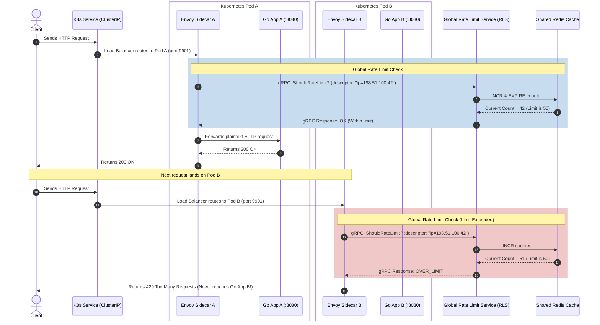

# 🔁 Envoy Routing & Resilience: Retry Policies & Hedging

This guide details Envoy’s built-in L7 resilience features, focusing on **Retry Policies**, **Retry Budgets**, **Host Selection Predicates during retries**, and **Request Hedging**.

---

## 🗺️ Retry Policy Hierarchy & Precedence

Resilience in Envoy can be declared at two levels of L7 routing hierarchy:

1. **Virtual Host Level**: Applies as the baseline retry policy for *all* routes defined under that virtual host.
2. **Route Level**: Overrides the virtual host's policy completely.

> [!WARNING]
> If a route-level retry policy is declared, it is treated **completely separately**. It **does not inherit** any values or fallbacks from the virtual host-level retry policy.

No matter where it is declared, the structural schema for configuring retries in your `envoy.yaml` remains identical. In addition to static configuration, clients can dynamically request specific retry behaviors via request headers (e.g., using the `x-envoy-retry-on` header).

---

## ⚙️ Core Configuration Parameters

Within the `retry_policy` block, you can configure the following resilience dials:

### 1. Maximum Number of Retries
* **Default Interval**: Envoy uses an **exponential backoff** algorithm by default to calculate intervals between retries.
* **Header Override**: You can override retry intervals dynamically per request using headers like `x-envoy-upstream-rq-per-try-timeout-ms`.
* **Bounded Retries**: All retry attempts are strictly bounded by the overall request timeout configured under `request_timeout`. If the overall request timer expires, all active retry attempts are cancelled immediately.
* **Default Count**: If a retry policy is declared without specifying a limit, Envoy defaults the number of retries to **one**.

### 2. Retry Budgets
A retry budget defines a limit on concurrent retry requests in relation to active requests. This acts as a circuit breaker for retries, preventing **retry storms** from overwhelming downstream services when they are already experiencing cascading failures.

### 3. Host Selection Retry Plugins
Normally, retries follow the same load-balancing host selection logic as the original request. However, if a host just failed, you often want to avoid retrying that same host. 
By utilizing **host selection predicates**, you can tell Envoy to reject specific hosts during retry rounds and force a re-selection. Common plugins include:
* `envoy.retry_host_predicates.previous_hosts`: Keeps track of previously attempted hosts and rejects them so retries are spread to healthy endpoints.
* `envoy.retry_host_predicates.canary_hosts`: Rejects hosts marked as canary (e.g., `canary: true` metadata) to avoid hitting experimental instances.

---

## 🧪 Concrete Retry Configuration Examples

Here are concrete, production-ready examples demonstrating how retry policies are declared.

### Example A: Basic 5xx Upstream Retry Policy
Matching the `/status/500` path on a backend `httpbin` cluster:

```yaml
route_config:
  name: 5xx_route
  virtual_hosts:
    - name: httpbin
      domains: ["*"]
      routes:
        - match:
            path: "/status/500"
          route:
            cluster: httpbin
            # ========================================================
            # Route-level Retry Policy
            # ========================================================
            retry_policy:
              retry_on: "5xx"      # Retry condition: any 5xx response code
              num_retries: 5       # Max retries before returning failure
```

#### 📊 Understanding the Log Output:
If a client issues a request to `/status/500`, the request eventually fails with a `500` error once all retry budgets are exhausted. Envoy will write a line to its access log resembling:

```text
[2026-08-23T18:43:29.515Z] "GET /status/500 HTTP/1.1" 500 URX 0 0 269 269 "-" "curl/7.64.0" "1ae9ffe2-21f2-43f7-ab80-79be4a95d6d4" "localhost:10000" "127.0.0.1:5000"
```

* **`500`**: The HTTP response code returned to the client.
* **`URX`**: The **Envoy Response Flag** explaining the failure rationale. 
  * `URX` means that Envoy terminated the request because the **Upstream Retry limit was reached (or the Request budget was eXceeded)**.

---

## 📋 Retry Conditions (`retry_on`) Reference

The `retry_on` configuration string can accept one or more conditions, separated by a comma:

| Retry Condition (`retry_on`) | Description |
| :--- | :--- |
| **`5xx`** | Retry on any 5xx response code, or if the upstream doesn't respond (includes connect-failure and refused-stream). |
| **`gateway-error`** | Retry specifically on `502 Bad Gateway`, `503 Service Unavailable`, or `504 Gateway Timeout` response codes. |
| **`reset`** | Retry if the upstream resets the TCP connection or doesn't respond at all. |
| **`connect-failure`** | Retry if the connection to the upstream server fails (e.g. connection timeout). |
| **`envoy-ratelimited`** | Retry if the `x-envoy-ratelimited` header is present in the upstream response. |
| **`retriable-4xx`** | Retry if the upstream responds with a retriable 4xx response code (currently, HTTP `409 Conflict` only). |
| **`refused-stream`** | Retry if the upstream resets the HTTP/2 or HTTP/3 stream with a `REFUSED_STREAM` error code. |
| **`retriable-status-codes`** | Retry if the upstream response matches status codes defined dynamically in the `x-envoy-retriable-status-codes` request header. |
| **`retriable-headers`** | Retry if upstream response includes headers matching names defined in the `x-envoy-retriable-header-names` request header. |

---

### Example B: Host Predicate Avoidance Retry Configuration
This setup uses the `previous_hosts` predicate to ensure retries do not attempt to contact the same failed host twice, trying up to 5 times to pick a new endpoint:

```yaml
route_config:
  name: 5xx_route
  virtual_hosts:
    - name: httpbin
      domains: ["*"]
      routes:
        - match:
            path: "/status/500"
          route:
            cluster: httpbin
            retry_policy:
              retry_on: "5xx"
              num_retries: 5
              # ========================================================
              # Avoid sending retries to the previously failed host
              # ========================================================
              retry_host_predicate:
                - name: envoy.retry_host_predicates.previous_hosts
              host_selection_retry_max_attempts: 5
```

---

### 🛠️ Master Template: Fully Complete `envoy.yaml` with Advanced Retry Emphasis

Here is a fully complete `envoy.yaml` that you can read, copy, or write by hand without fear. It highlights how **L7 Retry Policies** are embedded into the routing layer, complete with exponential back-off, timeout constraints, and host-avoidance predicates, backed by a multi-endpoint cluster at the bottom:

```yaml
# ====================================================================
# FULLY COMPLETE ENVOY.YAML CONFIGURATION LAYOUT
# Demonstrating L4 Listener -> L7 HCM Filter -> Advanced L7 Retry Policy -> Multi-Host Cluster
# ====================================================================

static_resources:
  listeners:
    - name: my_http_listener
      address:
        socket_address:
          address: 0.0.0.0
          port_value: 80 # Listen on L4 Port 80

      filter_chains:
        - filters:
            # ────────────────────────────────────────────────────────
            # EXACTLY ONE L4 Network Filter in the L4 chain list!
            # ────────────────────────────────────────────────────────
            - name: envoy.filters.network.http_connection_manager
              typed_config:
                "@type": type.googleapis.com/envoy.extensions.filters.network.http_connection_manager.v3.HttpConnectionManager
                stat_prefix: ingress_http

                # ─── SIBLING 1: Routing Map (With Advanced Retries) ───
                route_config:
                  name: local_route
                  virtual_hosts:
                    - name: app_service
                      domains: ["*"]
                      routes:
                        - match:
                            prefix: "/api/unstable" # Matches our unstable endpoints
                          route:
                            cluster: app_cluster
                            timeout: 2.0s # Overall HTTP request deadline
                            
                            # ========================================================
                            # ADVANCED L7 RETRY POLICY
                            # ========================================================
                            retry_policy:
                              # 1. Triggers: Retry on 5xx errors, network timeouts, and HTTP/2 resets
                              retry_on: "5xx,connect-failure,refused-stream"
                              
                              # 2. Limit: Try up to 3 times before declaring a final failure
                              num_retries: 3
                              
                              # 3. Request Cap: Limit each individual attempt to 0.25 seconds
                              per_try_timeout: 0.25s
                              
                              # 4. Back-off Strategy: Exponential delay spacing between tries
                              retry_back_off:
                                default_interval: 0.05s # Base delay before try 1 (50ms)
                                max_interval: 0.5s     # Ceiling cap on delay length (500ms)
                              
                              # 5. Host Avoidance: Ensure retries dial a different, healthy host!
                              retry_host_predicate:
                                - name: envoy.retry_host_predicates.previous_hosts
                                  typed_config:
                                    "@type": type.googleapis.com/envoy.extensions.retry.host.previous_hosts.v3.PreviousHostsPredicate
                              
                              # 6. Retry Attempts Selection Threshold
                              host_selection_retry_max_attempts: 5

                # ─── SIBLING 2: HTTP Processing Stack ───
                http_filters:
                  - name: envoy.filters.http.router
                    typed_config:
                      "@type": type.googleapis.com/envoy.extensions.http.router.v3.Router

  # ────────────────────────────────────────────────────────
  # UPSTREAM CLUSTERS (Defining multiple backend endpoints)
  # ────────────────────────────────────────────────────────
  clusters:
    - name: app_cluster
      connect_timeout: 0.25s
      type: STATIC
      lb_policy: ROUND_ROBIN
      load_assignment:
        cluster_name: app_cluster
        endpoints:
          - lb_endpoints:
              # Endpoints 1: Instance A
              - endpoint:
                  address:
                    socket_address:
                      address: 10.0.1.5
                      port_value: 8080
              # Endpoints 2: Instance B (Allows Host Predicate Avoidance to pick this if A fails)
              - endpoint:
                  address:
                    socket_address:
                      address: 10.0.1.6
                      port_value: 8080
```

---

## 🔀 Request Hedging (Concurrent Outbound Attempts)

**Request Hedging** is an advanced resilience strategy where Envoy proactively sends multiple concurrent requests to different upstream hosts, using whichever host responds first and discarding the slower requests.

> [!CAUTION]
> Hedging should **only** be configured for **idempotent requests** (e.g., safe HTTP `GET` calls) where making the same request multiple times has no side effects on your backend databases.

### How Hedging Works in Envoy:
* Envoy performs hedging in response to **per-try timeouts**. 
* When the initial outbound request times out, Envoy fires off a retry request *without* cancelling the original request.
* Both requests run concurrently. Envoy forwards the first successful response to the downstream client.

### Example C: Configuring Hedging at the Virtual Host Level

You enable hedging by setting `hedge_on_per_try_timeout` to `true` inside a `hedge_policy` block:

```yaml
route_config:
  name: 5xx_route
  virtual_hosts:
    - name: httpbin
      domains: ["*"]
      # ========================================================
      # Virtual Host Hedging Policy
      # ========================================================
      hedge_policy:
        hedge_on_per_try_timeout: true
      routes:
        - match:
            prefix: "/api/idempotent"
          route:
            cluster: httpbin
            timeout: 0.5s

---

## 🌐 Global Rate Limiting across Multiple Kubernetes Pods

When scaling an upstream service behind a Kubernetes `Service` (e.g. 5 replica pods), **Local Rate Limiting** is insufficient.
* **The Local Limit Problem**: If you set a local limit of `100 rps` on each sidecar, and you have 5 pods, the overall cluster can handle up to `500 rps` in aggregate. However, if a single pod receives a sudden burst, it will rate-limit at `100 rps` even if the other 4 pods are completely idle. This is uneven and not truly "global".

To enforce a strict limit across the entire Kubernetes Service collectively, Envoy uses a **Global Rate Limit Architecture**.

---

### 🗺️ The Architecture (Envoy + Rate Limit Service + Redis)

Instead of keeping track of counters in memory locally, all Envoy sidecars delegate the decision-making to a centralized external **Rate Limit Service (RLS)** via a high-performance **gRPC API**, which stores the counters in a shared **Redis** database:



---

### ⚙️ How it is Configured in Envoy

To link this up, your Envoy configurations require two components:

#### 1. Define the Global Rate Limit Service as a Cluster
Each Envoy sidecar needs to know where to find the centralized gRPC Rate Limit Service:

```yaml
static_resources:
  clusters:
    - name: global_rate_limiter
      type: STRICT_DNS
      connect_timeout: 0.25s
      lb_policy: ROUND_ROBIN
      http2_protocol_options: {} # Must use HTTP/2 for gRPC
      load_assignment:
        cluster_name: global_rate_limiter
        endpoints:
          - lb_endpoints:
              - endpoint:
                  address:
                    socket_address:
                      address: ratelimit-service.infra.svc.cluster.local
                      port_value: 8081
```

#### 2. Configure the HTTP Filter & Route Descriptors
You register the `envoy.filters.http.ratelimit` filter in your `http_filters` chain:

```yaml
# Inside http_connection_manager http_filters:
http_filters:
  - name: envoy.filters.http.ratelimit
    typed_config:
      "@type": type.googleapis.com/envoy.extensions.filters.http.ratelimit.v3.RateLimit
      domain: my_api_limits
      rate_limit_service:
        grpc_service:
          envoy_grpc:
            cluster_name: global_rate_limiter
        transport_api_version: V3

  - name: envoy.filters.http.router
    typed_config:
      "@type": type.googleapis.com/envoy.extensions.filters.http.router.v3.Router
```

#### 3. Define the Actions on the Virtual Host
Inside your `route_config`, you define the **action descriptors** that Envoy will extract from the request and send to the RLS (e.g., rate limit based on the downstream client's remote address IP):

```yaml
route_config:
  virtual_hosts:
    - name: httpbin
      domains: ["*"]
      routes:
        - match: { prefix: "/" }
          route:
            cluster: local_app
            rate_limits:
              - actions:
                  - remote_address: {} # Extracts client IP as the key sent to RLS
```

---

---

### 🎯 Key Architectural Benefits in Kubernetes:
1. **Perfect Accuracy**: Enforces a strict limit across all pods collectively, regardless of how Kubernetes load-balances requests across endpoints.
2. **Zero App Overhead**: Your Go Application container is never aware of the rate limiter; Envoy blocks invalid requests (`429 Too Many Requests`) at the proxy level, saving your app container's CPU/memory resources entirely.
3. **Fail-Open Strategy**: You can configure Envoy's Rate Limit filter to **fail-open** (`failure_mode_deny: false`). If the centralized Redis or RLS deployment goes down, Envoy will allow requests to pass directly to your app rather than throwing errors to your users.

---

## 🧪 Deep Dive Example: Rate Limiting `POST /api` with Actions & Descriptors

Let's look at a concrete, production scenario: You want to limit **`POST`** requests to your **`/api`** endpoint (e.g. max 10 requests per minute) to protect a database write-path from abuse.

To do this, you must configure:
1. **Envoy Actions**: Instructs the Envoy proxy how to inspect the incoming HTTP headers and generate a descriptor block.
2. **RLS Descriptors**: The corresponding rules running in your external Global Rate Limit Service telling it how to match those keys and what rate capacity to enforce.

---

### 1. The Request (Downstream to Envoy)
A client sends a write request:
* **HTTP Method**: `POST`
* **Path**: `/api`

---

### 2. The Envoy Configuration (Generating the Descriptors)
In `envoy.yaml`, you configure the route matching `/api` and define the extraction **actions**:

```yaml
route_config:
  name: local_route
  virtual_hosts:
    - name: backend_service
      domains: ["*"]
      routes:
        - match:
            path: "/api"
            headers:
              - name: ":method"
                exact_match: "POST"
          route:
            cluster: local_app
            # ========================================================
            # Define how Envoy generates the rate limit key structure
            # ========================================================
            rate_limits:
              - actions:
                  # Action 1: Extract the HTTP Method header
                  - request_headers:
                      header_name: ":method"
                      descriptor_key: "http_method"
                  # Action 2: Extract the target Path header
                  - request_headers:
                      header_name: ":path"
                      descriptor_key: "http_path"
```

#### How Envoy processes this:
1. The incoming request matches the route path `/api` and HTTP method `POST`.
2. Envoy runs **Action 1** ➔ reads `:method` value `POST` ➔ generates descriptor pair `http_method=POST`.
3. Envoy runs **Action 2** ➔ reads `:path` value `/api` ➔ generates descriptor pair `http_path=/api`.
4. Envoy combines these into an **ordered descriptor list** and fires it over the high-performance gRPC channel to the RLS:
   ```json
   [
     {"key": "http_method", "value": "POST"},
     {"key": "http_path", "value": "/api"}
   ]
   ```

---

### 3. The Rate Limit Service (RLS) Rule Configuration
In your centralized Rate Limit Service config file (which defines rules mapped to Redis counters), you write the matching rule hierarchy. 

**Order is critical!** The keys must align exactly with the list structure sent by Envoy:

```yaml
domain: my_api_limits
descriptors:
  - key: http_method
    value: POST
    descriptors:
      - key: http_path
        value: /api
        rate_limit:
          unit: MINUTE
          requests_per_unit: 10 # Only allows 10 requests per minute!
```

### 🔁 The End-to-End Resolution:
1. **Client** hits the gateway with `POST /api`.
2. **Envoy** builds the structured list: `[http_method=POST, http_path=/api]`.
3. **RLS** receives this, traverses its nested rules, matches `http_method=POST` ➔ `http_path=/api`, and queries Redis.
4. **Redis** increments the counter. If the counter exceeds `10` in that minute interval, the RLS returns `OVER_LIMIT` to Envoy.
5. **Envoy** immediately terminates the connection, returning a `429 Too Many Requests` status code back to the client.

---

## 🧮 Rate-Limiting Algorithms: The Token Bucket & Beyond

Enforcing rate limits requires selecting an appropriate mathematical algorithm. Envoy’s built-in **Local Rate Limiting** is powered by the highly popular and versatile **Token Bucket** algorithm.

---

### 🪣 1. The Token Bucket Algorithm (Envoy's Native Strategy)

In Envoy’s Local Rate Limiter, the token bucket controls request allowance using three primary settings:
*   **`max_tokens`**: The total capacity of the bucket. This defines the **maximum burst size** the proxy will allow at once.
*   **`tokens_per_fill`**: The number of tokens added to the bucket during each refill interval.
*   **`fill_interval`**: How often (e.g. every `1s`, `60s`) the bucket is refilled.

#### 💡 How it works:
* An empty bucket starts with `max_tokens`.
* Each incoming request consumes **exactly 1 token**.
* If tokens are available, the request is allowed. If the bucket is empty (`0 tokens`), Envoy immediately drops the request and returns a `429 Too Many Requests`.
* Over time, the bucket is replenished by `tokens_per_fill` at every `fill_interval` boundary, up to the ceiling of `max_tokens`.

```text
       Refill (tokens_per_fill / fill_interval)
                 │
                 ▼
          ┌─────────────┐
          │ ◯ ◯ ◯ ◯ ◯ ◯ │ ◄── Bucket Capacity (max_tokens)
          └──────┬──────┘
                 │
                 ▼  Request consumes 1 token
             [ Allowed ]
```

---

### ⚖️ Comparison of Industry Rate-Limiting Algorithms

Depending on your traffic profile, you might select or configure different algorithms. Here is a comparison of the top five industry algorithms, detailing their operational mechanics, Pros, and Cons:

| Algorithm | How It Works | 👍 Pros (When to use) | 👎 Cons (When to avoid) |
| :--- | :--- | :--- | :--- |
| **Token Bucket** <br>*(Envoy's Default)* | Tokens are added to a bucket of capacity `max_tokens` at a steady rate. Requests consume tokens. | • **Supports Bursts**: Handles spikes of traffic elegantly up to `max_tokens` size. <br>• **High performance** and highly memory efficient. | • **Burst potential**: Can temporarily stress downstream resources if massive bursts occur. |
| **Leaky Bucket** | Requests enter a queue/bucket and drip out to the backend at a **constant, smooth rate**. | • **Smooths Traffic**: Completely eliminates bursts, providing highly predictable load. | • **Adds Latency**: Queued requests are delayed to maintain the drip rate. <br>• **Rejects early** if the queue overflows. |
| **Fixed Window Counter** | Tracks request count inside a fixed window (e.g., a specific clock minute). Resets to 0 when the window rolls over. | • **Simplicity**: Very easy to implement and extremely low memory overhead. | • **Boundary Bursting**: Can allow **double the limit** to pass at window boundaries (e.g., maximum requests at `11:59:59` and again at `12:00:00`). |
| **Sliding Window Log** | Tracks a timestamped log of *every* request. Discards logs older than the rolling window and counts remaining logs. | • **Extreme Accuracy**: Totally eliminates the boundary bursting problem. | • **High Memory Cost**: Must store timestamps for every single request, making it highly memory-expensive under high load. |
| **Sliding Window Counter** | Approximates a sliding window by calculating a weighted sum of the current and previous fixed window counters. | • **High Performance**: Extremely accurate with very low memory footprint (does not store individual logs). | • **Approximation**: Has a tiny approximation error (~4-5%) if traffic spikes sharply at window boundary lines. |

---

## 🗺️ Quick-Reference Key Map: Envoy vs. Rate Limit Service (RLS)

To quickly bridge Envoy's config with your Rate Limit Service rules, use this direct schema mapping cheat sheet:

### 1. In `envoy.yaml` (The Client/Traffic Proxy)
* **Purpose**: Inspect traffic, extract headers, and generate descriptor labels.
* **Exact Path Key**: Under `routes.route.rate_limits`
* **Key to search for**: **`rate_limits`** -> **`actions`**

```yaml
# FILE: envoy.yaml
routes:
  - match: { path: "/api" }
    route:
      cluster: my_service
      # ────────── SEARCH FOR THIS KEY ──────────
      rate_limits:
        - actions:
            - request_headers:
                header_name: ":method"
                descriptor_key: "http_method"  # ◄── Label sent to RLS
```

---

### 2. In `ratelimit.yaml` (The External Rate Limit Daemon config)
* **Purpose**: Evaluate values, match nested decision trees, and apply limits.
* **Exact Path Key**: Under `domain`
* **Key to search for**: **`descriptors`**

```yaml
# FILE: ratelimit.yaml (RLS Rule Config)
domain: my_api_limits
# ────────── SEARCH FOR THIS KEY ──────────
descriptors:
  - key: http_method                          # ◄── Matches descriptor_key from Envoy
    value: POST                               # ◄── Matches the extracted value
    rate_limit:
      unit: MINUTE
      requests_per_unit: 10
```

---

### 🛠️ Master Template: Fully Complete `envoy.yaml` with Global Rate Limiting

Here is the fully complete, unified `envoy.yaml` showing exactly how the **L7 Rate Limit Filter**, **Route Extraction Actions**, and the **gRPC Cluster** connect together inside a single, valid configuration layout:

```yaml
# ====================================================================
# FULLY COMPLETE ENVOY.YAML CONFIGURATION LAYOUT
# Demonstrating L4 Listener -> L7 HCM Filter -> Route Actions -> RLS gRPC Cluster
# ====================================================================

static_resources:
  listeners:
    - name: my_http_listener
      address:
        socket_address:
          address: 0.0.0.0
          port_value: 80 # Listen on L4 Port 80

      filter_chains:
        - filters:
            # ────────────────────────────────────────────────────────
            # EXACTLY ONE L4 Network Filter in the L4 chain list!
            # ────────────────────────────────────────────────────────
            - name: envoy.filters.network.http_connection_manager
              typed_config:
                "@type": type.googleapis.com/envoy.extensions.filters.network.http_connection_manager.v3.HttpConnectionManager
                stat_prefix: ingress_http

                # ─── SIBLING 1: Routing Map & Actions ───
                route_config:
                  name: local_route
                  virtual_hosts:
                    - name: backend_service
                      domains: ["*"]
                      routes:
                        - match:
                            path: "/api"
                            headers:
                              - name: ":method"
                                exact_match: "POST"
                          route:
                            cluster: local_app
                            
                            # ========================================================
                            # ACTION DESCRIPTORS EXTRACTION
                            # ========================================================
                            rate_limits:
                              - actions:
                                  # Action 1: Extract HTTP Method
                                  - request_headers:
                                      header_name: ":method"
                                      descriptor_key: "http_method"
                                  # Action 2: Extract Path
                                  - request_headers:
                                      header_name: ":path"
                                      descriptor_key: "http_path"

                # ─── SIBLING 2: HTTP Processing Stack ───
                http_filters:
                  # ========================================================
                  # L7 GLOBAL RATE LIMIT FILTER REGISTRATION
                  # ========================================================
                  - name: envoy.filters.http.ratelimit
                    typed_config:
                      "@type": type.googleapis.com/envoy.extensions.filters.http.ratelimit.v3.RateLimit
                      domain: my_api_limits
                      rate_limit_service:
                        grpc_service:
                          envoy_grpc:
                            cluster_name: global_rate_limiter # ◄── Points to the cluster below
                        transport_api_version: V3

                  # --- TERMINAL FILTER ---
                  - name: envoy.filters.http.router
                    typed_config:
                      "@type": type.googleapis.com/envoy.extensions.http.router.v3.Router

  # ────────────────────────────────────────────────────────
  # UPSTREAM CLUSTERS
  # ────────────────────────────────────────────────────────
  clusters:
    # Cluster A: Your local backend Application
    - name: local_app
      connect_timeout: 0.25s
      type: STATIC
      lb_policy: ROUND_ROBIN
      load_assignment:
        cluster_name: local_app
        endpoints:
          - lb_endpoints:
              - endpoint:
                  address:
                    socket_address:
                      address: 127.0.0.1
                      port_value: 8080

    # Cluster B: Centralized gRPC Rate Limit Service (RLS)
    - name: global_rate_limiter
      connect_timeout: 0.25s
      type: STRICT_DNS
      lb_policy: ROUND_ROBIN
      http2_protocol_options: {} # ◄── CRITICAL: Must use HTTP/2 for gRPC stream!
      load_assignment:
        cluster_name: global_rate_limiter
        endpoints:
          - lb_endpoints:
              - endpoint:
                  address:
                    socket_address:
                      address: ratelimit-service.infra.svc.cluster.local
                      port_value: 8081 # The gRPC port of RLS
```

---

## 🧱 Component Roles & Physical Architecture

To fully understand how global rate limiting resolves distributed state in Kubernetes, it helps to understand the exact division of duties and physical network path.

### 📦 Physical Duties & Config Reference

| Component / Container | What it is | Configuration File / Config Source | What is inside the config? |
| :--- | :--- | :--- | :--- |
| **Envoy Proxy** <br>*(Sidecar or Gateway)* | The actual network proxy that intercepts and load-balances client connections. | **`envoy.yaml`** | • Tells Envoy what gRPC cluster endpoint the RLS daemon runs on.<br>• Instructs Envoy to extract header values and send them dynamically to RLS. |
| **Rate Limit Service (RLS)** <br>*(Lyft Rate Limit Container)* | A standalone, lightweight gRPC server daemon running in your cluster. | **`ratelimit.yaml`** (ConfigMap) + **Env envs** (Deployment manifest) | • **`ratelimit.yaml`**: Defines nested business rules & limits (e.g. `POST /api = 10/min`).<br>• **Env Variables**: Configures the connection to the external Redis cluster (URLs, auth, types). |
| **Redis** <br>*(Cache Database)* | High-performance in-memory key-value database. | *Standard DB instances* | • Stores the raw numerical counters (e.g. `IP:198.51.100.42 = 8 requests`). |

---

### 🎨 The Physical Network Path (ASCII Diagram)

```text
  [ Client Request ] (HTTP)
         │
         ▼
+─────────────────────────────────────────────────────────+
| Kubernetes Pod                                          |
|                                                         |
|    +───────────────────────────────────────────────+    |
|    |                 Envoy Sidecar                 |    |
|    +───────┬───────────────────────────────┬───────+    |
|            │                               │            |
|            │ 1. gRPC Check                 │ 3. If OK   |
|            │ (ShouldRateLimit?)            │ (Plaintext)|
|            ▼                               ▼            |
|            │                       +───────────────+    |
|            │                       |  Your Go App  |    |
|            │                       |  (Port 8080)  |    |
|            │                       +───────────────+    |
+────────────┼────────────────────────────────────────────+
             │
             ▼ (gRPC over HTTP/2)
+─────────────────────────────────────────────────────────+
| Standalone RLS Pod                                      |
|                                                         |
|    +───────────────────────────────────────────────+    |
|    |           Rate Limit Container                |◄─── [ ratelimit.yaml ] (Rules)
|    |          (Reads ratelimit.yaml)               |◄─── [ Env Variables ]  (Redis Conn)
|    +───────┬───────────────────────────────────────+    |
+────────────┼────────────────────────────────────────────+
             │
             ▼ (Redis TCP Protocol / REDIS_URL)
+─────────────────────────────────────────────────────────+
| Redis Cluster / Pod                                     |
|                                                         |
|    +───────────────────────────────────────────────+    |
|    |                Redis Database                 |    |
|    |             (Stores HTTP counters)            |    |
|    +───────────────────────────────────────────────+    |
+─────────────────────────────────────────────────────────+
```

---

### 🧠 Caching vs. Rate Limiting: Where does the State live?

When designing resilient service meshes, developers often contrast how HTTP Caching and Rate Limiting manage state:

#### 1. HTTP Caching: In-Memory & Self-Contained (No gRPC/Redis required!)
The built-in `envoy.extensions.http.cache.simple` provider runs inside Envoy's own memory footprint:
*   **Where data lives**: In-memory (Envoy's local RAM).
*   **Why it's local**: Caching is usually resource-independent. Serving a cached response locally saves latency and avoids any network hops.

#### 2. Global Rate Limiting: Distributed & Centralized (gRPC & Redis Required)
Rate limits enforce shared constraints across many pods collectively:
*   **Where data lives**: In a centralized **Redis** database, queried by the **RLS** container.
*   **The RLS Container Dual-Configuration**: 
    To connect the RLS container to the external Redis database, you must supply connection credentials at container deployment time:
    ```yaml
    # RLS Container Deployment manifest configuration
    env:
      - name: REDIS_TYPE
        value: "standalone" # standalone, sentinel, or cluster
      - name: REDIS_URL
        value: "redis://redis-master.infra.svc.cluster.local:6379"
      - name: REDIS_AUTH
        value: "my-secure-redis-password"
    ```
*   **Why it can't be local**: If Pod A and Pod B only tracked limits in their own local RAM, a client could bypass limits by spreading traffic across instances. Shared state in Redis is mandatory.

---

### 🌐 Official Reference Resources

*   **Envoy's Global Rate Limit HTTP Filter**: Official specification of the Envoy filter schema. ➔ [Envoy Docs: rate_limit](https://www.envoyproxy.io/docs/envoy/latest/configuration/http/http_filters/rate_limit_filter)
*   **Lyft's Reference RLS Container**: The absolute reference implementation of the gRPC RLS server. ➔ [GitHub: envoyproxy/ratelimit (Lyft)](https://github.com/envoyproxy/ratelimit)
*   **Istio Rate Limiting Guide**: How Istio coordinates these components dynamically. ➔ [Istio Docs: Rate Limiting](https://istio.io/latest/docs/tasks/policy-enforcement/rate-limiting/)


