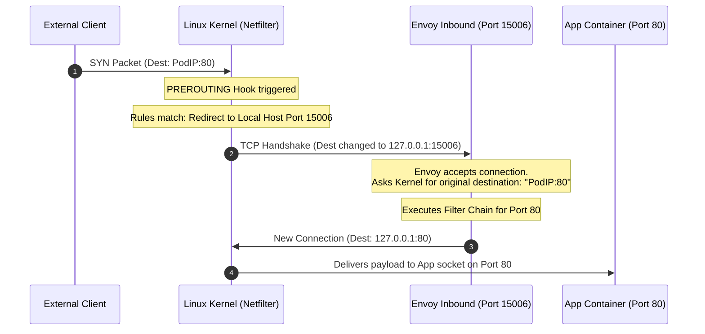
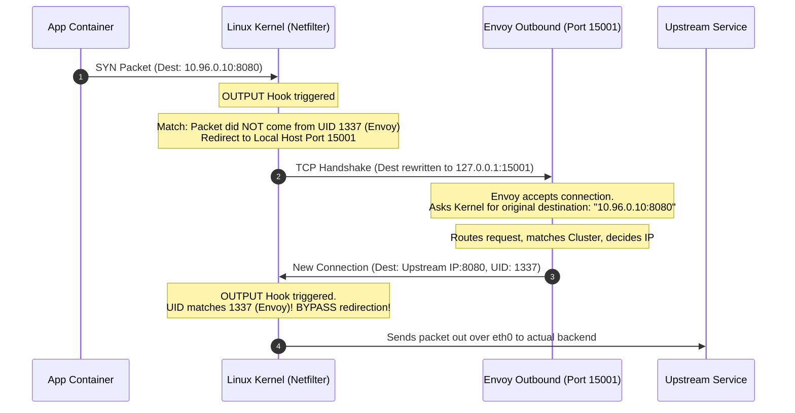

# Demystifying Istio Network Interception: A Low-Level Deep Dive

It is completely natural to feel uneasy about Istio's sidecar model. The idea that traffic is "magically" captured without modifying your application code can feel like a black box. 

This guide strips away the magic and explains exactly how **Linux kernel networking**, `iptables`, and **Envoy** work together to intercept, process, and forward TCP packets.

---

## 🛠️ The Core Foundation: Linux Netfilter & iptables

To understand interception, we must look at the **Linux Kernel**.

Inside the Linux kernel, there is a framework called **Netfilter**. Netfilter allows modules to register callbacks at specific points in the packet traversal path. **`iptables`** is the user-space utility used to configure the tables, chains, and rules provided by Netfilter.

When a TCP packet enters or leaves a network interface (like `eth0`), it travels through a series of "hooks" or "chains":

```text
                     +---------------------------------------+
                     |             Routing Decision          |
                     +---------------------------------------+
                                         |
                                         v
   +--------------+      +--------------+      +--------------+      +---------------+
   | PREROUTING   | ---> |    INPUT     | ---> | Local Process| ---> |    OUTPUT     |
   | (NIC Inbound)|      | (To socket)  |      | (Your App/Env)|     | (Outbound)    |
   +--------------+      +--------------+      +--------------+      +---------------+
          |                                                                  |
          +------------------------> [ FORWARD ] ----------------------------+
                                             |
                                             v
                                     +---------------+
                                     |  POSTROUTING  | ---> (Wire / NIC)
                                     +---------------+
```

---

## 🏗️ Step 1: Setting up the Trap (`istio-init`)

When a Kubernetes Pod starts up with Istio sidecar injection enabled, an init container named **`istio-init`** runs first. 
*   It runs with `NET_ADMIN` and `NET_RAW` Linux capabilities.
*   It executes a utility called `istio-iptables` which configures several custom chains inside the pod's network namespace.
*   Once it finishes executing, it exits, leaving the network rules configured in the kernel. The application container and `istio-proxy` (Envoy) then start.

### The Custom Istio Chains Created:
1.  **`ISTIO_INBOUND`**: Inspects inbound packets.
2.  **`ISTIO_OUTBOUND`**: Inspects outbound packets.
3.  **`ISTIO_IN_REDIRECT`**: Redirects inbound traffic to port `15006` (Envoy Inbound).
4.  **`ISTIO_REDIRECT`**: Redirects outbound traffic to port `15001` (Envoy Outbound).

---

## 📥 Step 2: Inbound Traffic Interception Trace (e.g., Client requests Port 80)

Let's trace a packet coming from a downstream client external to the pod, trying to hit your app running on port `80`.



### Detailed Inbound Steps inside the Kernel:
1.  **Packet Arrival**: A packet arrives at `eth0` with Destination IP = `PodIP` and Destination Port = `80`.
2.  **`PREROUTING` Chain**: 
    *   The kernel passes the packet through the `PREROUTING` chain.
    *   Istio rule matches: *"If the packet is TCP and the destination port is not excluded, jump to `ISTIO_INBOUND`."*
    *   `ISTIO_INBOUND` jumps to `ISTIO_IN_REDIRECT`.
    *   `ISTIO_IN_REDIRECT` applies a `REDIRECT` target, rewriting the destination to `127.0.0.1:15006` (Envoy's virtual inbound listener).
3.  **Local Delivery**: Since the destination is now localhost (`127.0.0.1`), the kernel routes it internally to Envoy listening on port `15006`.
4.  **The Original Destination Trick**: 
    > [!IMPORTANT]
    > How does Envoy know the client originally wanted port `80` if the packet was rewritten to `15006`?
    > 
    > Envoy calls a Linux system socket call: `getsockopt(fd, SOL_IP, SO_ORIGINAL_DST, ...)`. 
    > The kernel looks at its connection-tracking (conntrack) table, finds the original state, and returns the original destination: `PodIP:80`.
5.  **Envoy processing**: Envoy checks if it has an inbound listener or filter configured for port `80` (LDS/RDS rules). If yes, it runs policies (mTLS, RBAC, tracing).
6.  **Forwarding to App**: Envoy creates a *new* TCP connection to the application container via `127.0.0.1:80`. Because the connection originates from localhost (`127.0.0.1`), the `iptables` rules are written to ignore it, allowing it to bypass the redirect loop and reach your application directly.

---

## 📤 Step 3: Outbound Traffic Interception Trace (e.g., App requests external API)

Now, let's trace a request originating *inside* the pod from your application container, attempting to connect to an external service (e.g., `http://10.96.0.10:8080`).



### Detailed Outbound Steps inside the Kernel:
1.  **Packet Sent**: Your application calls `connect()` to `10.96.0.10:8080`. The kernel creates a packet.
2.  **`OUTPUT` Chain**:
    *   Before the packet leaves, it hits the Netfilter `OUTPUT` chain.
    *   Istio rule checks: *"Did this packet originate from the Envoy proxy container?"*
    *   **The Owner Match Filter (`-m owner --uid-owner 1337`)**: The `istio-proxy` container runs under user ID `1337`. If the packet's socket owner UID is **not** `1337`, it must be redirected!
    *   It jumps to `ISTIO_OUTBOUND`, which jumps to `ISTIO_REDIRECT`.
    *   `ISTIO_REDIRECT` applies a `REDIRECT` target, rewriting the destination to `127.0.0.1:15001` (Envoy's virtual outbound listener).
3.  **Envoy accepts Connection**: Envoy receives the connection on port `15001`.
4.  **Original Destination**: Envoy calls `getsockopt(..., SO_ORIGINAL_DST)` to retrieve the actual intended destination (`10.96.0.10:8080`).
5.  **Envoy routing**: Envoy checks its route configuration (RDS) to determine which logical cluster manages `10.96.0.10:8080`. It applies routing configurations (e.g., retry policies, circuit breakers, header additions).
6.  **Egress out of Pod**: Envoy initiates a new connection to the upstream endpoint.
    *   Because this outbound socket is owned by UID `1337` (Envoy itself), when the packet hits the `OUTPUT` chain, the kernel checks the UID rule, sees it matches `1337`, and **bypasses** the redirect chains entirely!
    *   The packet safely exits onto `eth0` to the wire without entering an infinite redirection loop.

---

## 🔍 Visualizing the Network Namespace

Inside the Pod's isolated network namespace, there are essentially two active socket endpoints and a local loopback (`lo`) bridge:

```text
+-------------------------------------------------------------------------------+
| POD NETWORK NAMESPACE                                                         |
|                                                                               |
|  +--------------------+                               +--------------------+  |
|  |   App Container    |                               | istio-proxy (UID)  |  |
|  |  (Local socket)    |                               |    Envoy Proxy     |  |
|  +---------+----------+                               +---------+----------+  |
|            |                                                    |             |
|            | (app socket connects)                              | (UID 1337)  |
|            v                                                    v             |
|   =========================================================================   |
|   KERNEL NETWORK STACK (netfilter / iptables redirects)                       |
|   =========================================================================   |
|            |                                                    |             |
|            +----> redirect via iptables rules ----------------->+ (Port 15001)|
|                                                                 |             |
|            +<---- local delivery bypassed <---------------------+ (Port 80)   |
|            |                                                    |             |
|            |                                                    v             |
|            +----------------------------------------------------+             |
|                                                                 |             |
|                                                                 v             |
|                                                               [eth0]          |
|                                                                 |             |
+-----------------------------------------------------------------+-------------+
                                                                  |
                                                                  v (To Cluster)
```
