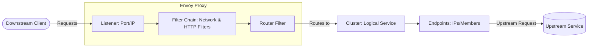
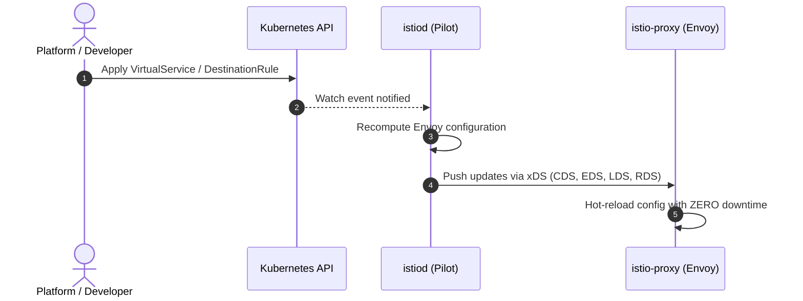

# CNCF-200: Envoy Fundamentals (Course Notes & Lab Configs)

This repository serves as a personal laboratory, learning log, and configuration playground as I go through the **CNCF-200 Envoy Fundamentals** course from [Tetrate Academy](https://academy.tetrate.io). 

The ultimate objective of this study is to lift the hood on modern service meshes and understand exactly how **Istio** utilizes Envoy sidecars under the curtain.

---

## 🗺️ Suggested Repository Structure

To organize your learning, code samples, JSON configurations, and conceptual breakdowns, consider structuring the repository as follows:

```text
.
├── README.md                  # This main course guide and cheat sheet
├── 01-bootstrap/              # Basic bootstrap configs, Downstream & Upstream concepts
│   ├── basic-envoy.yaml       # Simple Envoy static configuration
│   └── README.md              # Key takeaways on Envoy startup
├── 02-listeners-filters/      # Deep dive into network/HTTP filters, filter chains, & SNI
│   ├── http-filter.json       # HTTP connection manager configurations
│   └── README.md              # Discussion on filter mechanics
├── 03-routing-clusters/       # Path routing, weighted clusters, retries, and timeouts
│   ├── routing-rules.json     # Virtual host and route configurations
│   └── README.md              # Discussion on traffic shifting
├── 04-xds-dynamic-config/     # Dynamic configuration via Control Planes (LDS, RDS, CDS, EDS)
│   ├── bootstrap-dynamic.yaml # Configuring Envoy to talk to a management server
│   └── README.md              # Exploring the xDS protocol
└── 05-istio-integration/      # Bridging the gap: How Istio maps Custom Resources to Envoy configs
    ├── dump-istio-proxy.json  # Dump of an actual `istio-proxy` configuration
    └── README.md              # Detailed analysis of Pilot, iptables, and sidecar injection
```

---

## 🧩 Core Envoy Architecture at a Glance

Envoy is a high-performance, small-footprint L4/L7 proxy. Every connection is handled according to these concepts:



*   **Downstream (Relative POV: Where traffic comes *FROM*)**:
    > [!NOTE]
    > **The POV is always Envoy**. Downstream represents any client that **initiates a connection to Envoy**, sends requests, and receives responses (e.g. browser clients, AWS Application Load Balancers, or mesh peers).
*   **Upstream (Relative POV: Where traffic is sent *TO*)**:
    > [!NOTE]
    > **The POV is always Envoy**. Upstream represents the backend destination to which **Envoy initiates a connection** to forward the request and fetch responses (e.g. your local Go app container on `127.0.0.1:8080`, external databases, or third-party APIs).
*   **Listener**: A named network location (e.g., IP address and port) that client requests are sent to.
*   **Filters**: Pluggable modules that process requests/responses. They reside in filter chains and handle protocol parsing, rate limiting, logging, RBAC, etc.
*   **Routes**: Decides which **Cluster** receives a request, based on criteria like headers, URI paths, or hostnames.
*   **Clusters**: A logical group of upstream hosts (endpoints) that Envoy loads balances traffic across.
*   **Endpoints**: The actual network-addressable instances of your service (IP + port) inside a Cluster.

---

## 🎭 Behind the Curtain: How Istio Really Works

Istio is fundamentally a **Control Plane** (`istiod`) that configures a **Data Plane** composed of **Envoy** proxies (`istio-proxy`) running as sidecars. Here is how they interact:



### 1. Sidecar Injection & Interception
*   When a Pod starts with Istio injection enabled, a mutating webhook injects an `istio-init` container and an `istio-proxy` (Envoy) container.
*   The `istio-init` container configures `iptables` rules on the node/pod.
*   **The Magic**: `iptables` intercepts all inbound and outbound TCP traffic and transparently redirects it to localhost port `15006` (inbound listener) and `15001` (outbound listener) of the Envoy proxy. The application is completely unaware of this.

### 2. The xDS Protocol (Dynamic Configuration)
In a service mesh, statically defining Envoy endpoints in a YAML file is impossible due to the ephemeral nature of Kubernetes pods. Instead, Envoy connects to `istiod` using the **xDS APIs** over gRPC:
*   **LDS (Listener Discovery Service)**: Tells Envoy what ports to listen on and which filter chains to run.
*   **RDS (Route Discovery Service)**: Defines routing rules (e.g., maps Istio's `VirtualService` rules to Envoy paths).
*   **CDS (Cluster Discovery Service)**: Defines backend services (e.g., maps Kubernetes `Services` and Istio's `DestinationRules` to clusters).
*   **EDS (Endpoints Discovery Service)**: Constantly updates Envoy with the live Pod IPs of backends.

---

## 🛠️ Helpful Commands & Cheat Sheet

### Running Envoy Locally with Docker
To test any configuration JSON or YAML quickly:
```bash
docker run --name local-envoy -d \
  -v $(pwd)/bootstrap.yaml:/etc/envoy/envoy.yaml \
  -p 10000:10000 \
  -p 9901:9901 \
  envoyproxy/envoy:v1.30.0
```

### Accessing the Envoy Admin Interface
Envoy exposes a powerful administration endpoint (typically on port `9901` or, in Istio, port `15000` via localhost):
*   **Get Envoy version and build info**: `curl http://localhost:9901/server_info`
*   **Dump the full active config**: `curl http://localhost:9901/config_dump`
*   **List all active clusters**: `curl http://localhost:9901/clusters`
*   **Check runtime configuration**: `curl http://localhost:9901/runtime`

### Inspecting Envoy inside Istio (using `istioctl`)
When you are ready to transition your Envoy knowledge to an actual Kubernetes cluster running Istio:
*   **Dump Envoy Config**: `istioctl proxy-config bootstrap <pod-name>.<namespace>`
*   **View Listeners**: `istioctl proxy-config listeners <pod-name>.<namespace>`
*   **View Routes**: `istioctl proxy-config routes <pod-name>.<namespace>`
*   **View Clusters**: `istioctl proxy-config clusters <pod-name>.<namespace>`
*   **View Endpoints**: `istioctl proxy-config endpoints <pod-name>.<namespace>`
*   **Analyze Sync Status**: `istioctl proxy-status`
